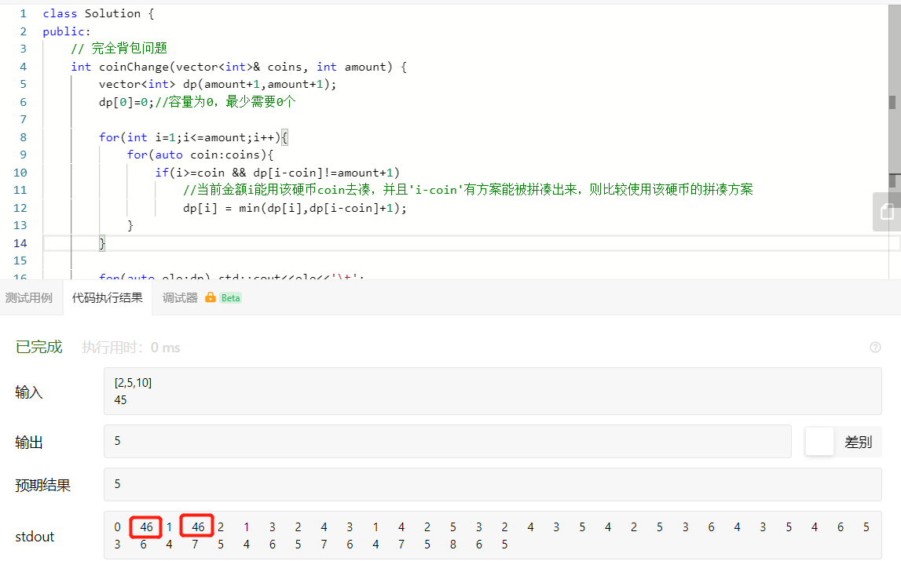

# 背包问题总结

> 三种背包问题： https://www.jianshu.com/p/50af9094a2ac 
>
> - 0-1
> - 完全背包
> - 多充背包

## 0-1背包

## 完全背包问题

### 零钱兑换1

> 思路分析：定义状态--> 确定状态转移方程-->思考边界条件

使用一位数组，定义`dp[i]`表示金额为i时的最优解（即拼凑金额为i最少需要的硬币数）。

则根据硬币列表方案，有：

- 如果金额`i`大于金币`coin`值，则其解为$min\{dp[i-coin]+1\}，for\ coin:coins$。并且值得注意的是，初始化`dp`的值为一个不可能达到的最大值，如此一来取`min`将记录已成功的拼凑方案。

### 零钱兑换2

>  https://leetcode-cn.com/problems/coin-change-2/ 
>
> 

## 多重背包问题

###### 