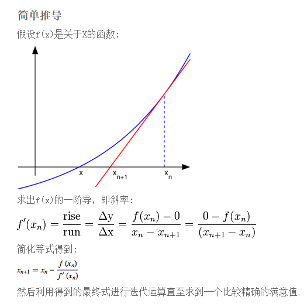

# 算法与数据结构总结

>  不过好在算法题可以刷题突击，而且有一个很明显的现象：面试难度<<笔试难度，其实非常好理解，笔试是在线oj，机器判卷，直接比对case的结果就好。但是面试要肉眼debug，这就难得多，而且很多题有多种不同解法，面试官自己也不是很懂，自己只会一种解法。如果出一道难题，没有很深功力的面试官你给出一个不同解法他短时间很难判断对错。于是乎，除了上面提到的几家公司，绝大部份的面试官都只在现场出一些经典问题，比如百度系的巨喜欢问==树的深度、公共父节点、最大路径等二叉树经典题的各种变种==。然而经典代表着网上解法到处都是，代表着即使不刷题，刷刷面经也可以搞定。 

> 记录算法与数据结构学习笔记和总结。

[背包问题详解](./DP/背包问题.md)

# 1.数据结构总结


# 2.剑指offer总结

字符串：

- cctype字符判断：数字、大写字母、小写字母，字母


# 3. leetcode高频笔试题和面试题

- 背包问题
- 字符串
- 单调栈：最大柱状面积
- 


# 4.算法总结

## 排序

| 排序算法 | 最好                | 最坏     | 平均     | 额外空间复杂度 | 稳定性 | 原地排序 |
| -------- | ------------------- | -------- | -------- | -------------- | ------ | -------- |
| 冒泡排序 | O(n)                | O(n^2)   | O(n^2)   | O(1)           | 是     | 是       |
| 插入排序 | O(n)                | O(n^2)   | O(n^2)   | O(1)           | 是     | 是       |
| 选择排序 | O(n^2)              | O(n^2)   | O(n^2)   | O(1)           | ==否== | 是       |
| 归并排序 | O(nlogn)            | O(nlogn) | O(nlogn) | O(n)           | 是     | 否       |
| 快速排序 | O(nlogn)            | O(n^2)   | O(nlogn) | O(1)           | ==否== | 是       |
| 堆排序   | O(nlogn)            | O(nlogn) | O(nlogn) | O(1)           | ==否== | 是       |
| 桶排序   | O(n)                | -        | -        | O(n)           | 是     | 否       |
| 计数排序 | O(n+k)(k是数据范围) | -        | -        | O(k)           | 是     | 否       |
| 基数排序 | O(n*d)(d是维度)     | -        | -        | O(n*d)         | 是     | 否       |

**[排序算法的稳定性]( https://blog.csdn.net/qq_34782804/article/details/93173170 ): 通俗地讲就是待排序的序列中有两元素相等,排序之后它们的先后顺序不变。例如：如果Ai = Aj，Ai原来在位置前，排序后Ai还是要在Aj位置前。 **

**不稳定排序**：选择排序、快速排序、堆排序

**面经** 

https://github.com/datawhalechina/Daily-interview/blob/master/coding/sort.md 


---

#### 牛顿迭代法求平方根：

 https://www.cnblogs.com/upcan/p/9907402.html 



```c++
#include <iostream>
#include <cmath>
using namespace std;

// err 是允许的误差
const double err = 1e-8;

double NtSqrt(const double num)
{
    if (num < 0)
    {
        return -1;
    }
    else
    {
        double root = num;
        // 如果原值减去近似根的平方大于误差，继续循环
        while (abs(num - root * root) >= err)
        {
            // 得到下一个近似根
            root = (num / root + root) / 2.0;
        }
        return root;
    }
}

int main()
{
    double num;
    cout << "请输入一个数: ";
    cin >> num;
    double ans = NtSqrt(num);
    if (ans == -1)
    {
        cout << "负数没有平方根" << endl;
    }
    else
    {
        cout << num << " 的平方根是 " << ans << endl;
    }
    return 0;
}
```


---

**主元素：**https://www.jianshu.com/p/9841425259e7 

```c++
vector<int> majorityElement(vector<int>& nums) 
{
    vector<int>ans;
    int n = nums.size();
    if(n<1)return ans;
    int cnt1=0,cnt2=0,tmp1=nums[0],tmp2=nums[0];
    for (int i = 0; i < n; i++) {
        if (nums[i] == tmp1)
            cnt1++;
        else if (nums[i] == tmp2)
            cnt2++;
        else if (cnt1 == 0) {
            tmp1 = nums[i];
            cnt1 = 1;
        } else if (cnt2 == 0) {
            tmp2 = nums[i];
            cnt2 = 1;
        } else {
            cnt1--;
            cnt2--;
        }
    }
    ans.push_back(tmp1);
    ans.push_back(tmp2);
    return ans;
}
```


---

单调栈：


---

二维数组中的查找

```c++
// 查找是否存在
bool SearchMatrix(vector<vector<int> > matrix, int target) {
    if(matrix.size() == 0) return false;
    int m = matrix.size(), n = matrix[0].size();
    int mid, low = 0, high = n * m - 1;
    while(low <= high) {
        mid = (low + high) / 2;
        int r = mid / n;
        int c = mid % n;
        if(matrix[r][c] == target) {
            return true;
        }
        else if(matrix[r][c] < target) {
            low = mid + 1;
        } 
        else {
            high = mid - 1;
        }
    }
    return false;
}

// 查找次数
int SearchMatrixP(vector<vector<int> > matrix, int target) {
    if(matrix.size() == 0) return 0;
    int m = matrix.size(), n = matrix[0].size();
    int i = m - 1, j = 0, cnt = 0;
    while(i >= 0 && j < n) {
        if(target == matrix[i][j]) {
            cnt ++;
            j ++;
        }
        else if(target > matrix[i][j]) {
            j ++;
        }
        else {
            i --;
        }
    }
    return cnt;
}
```


### 最小支撑树


#### 压缩字符串

```c++
class Solution {
public:
    int compress(vector<char>& chars) {
        int i;
        int len=0;
        
       for( i=0;i<chars.size();i++){
           int cnt=1;
            while(i+1<chars.size()&&chars[i]==chars[i+1]){
                cnt++;
                i++;
            }
           chars[len++]=chars[i];
           if(cnt==1)continue;
           for(char ch:to_string(cnt)){
               chars[len++]=ch;
           }
           
        }
        return len;
    }
};
```

